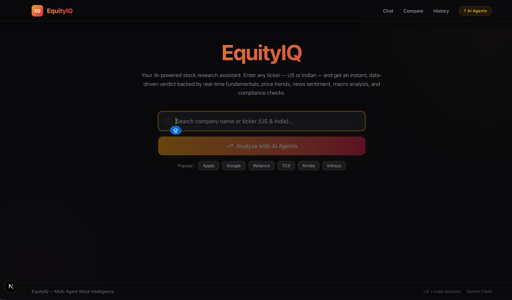
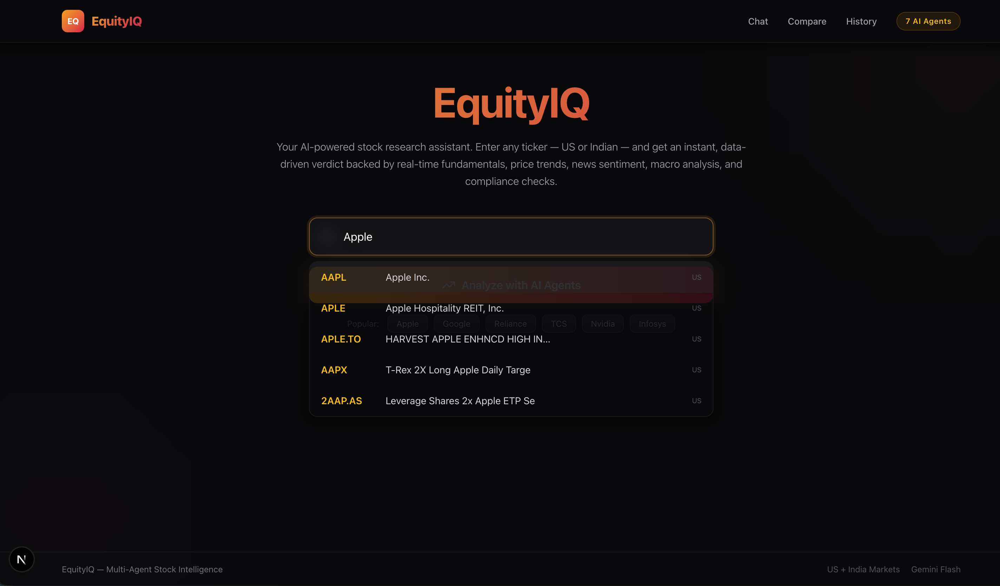
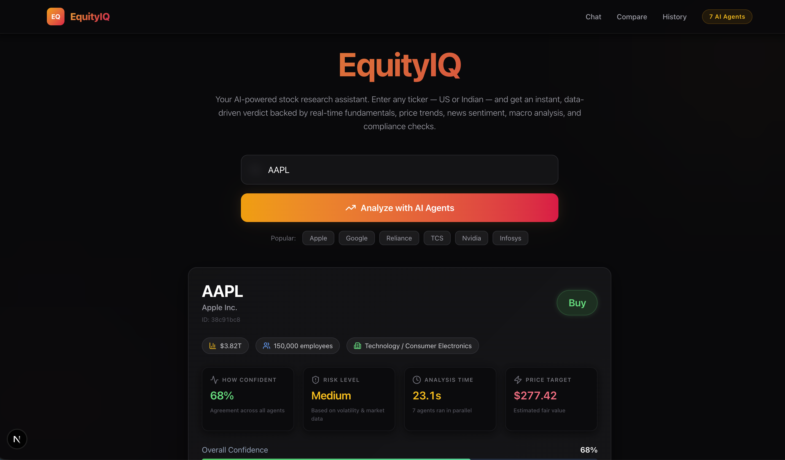
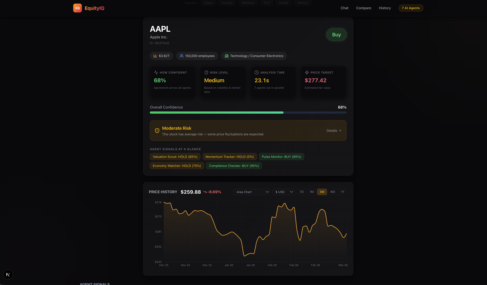
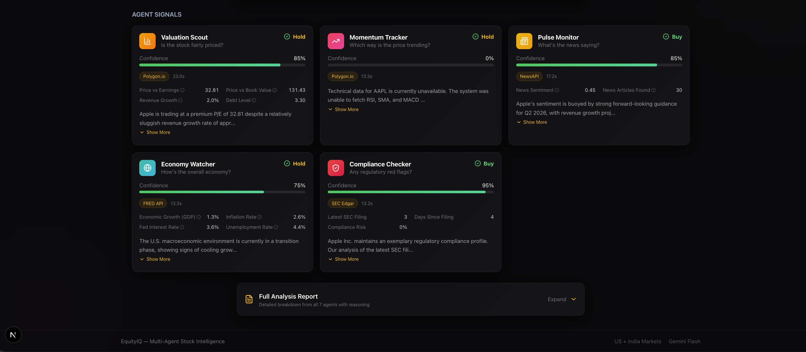
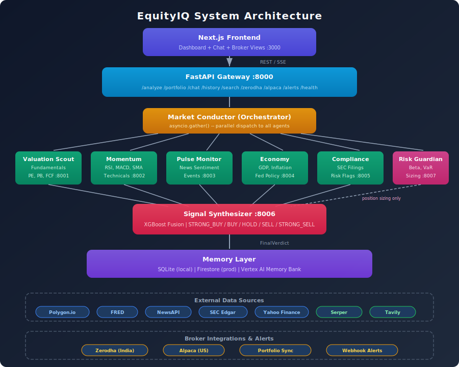
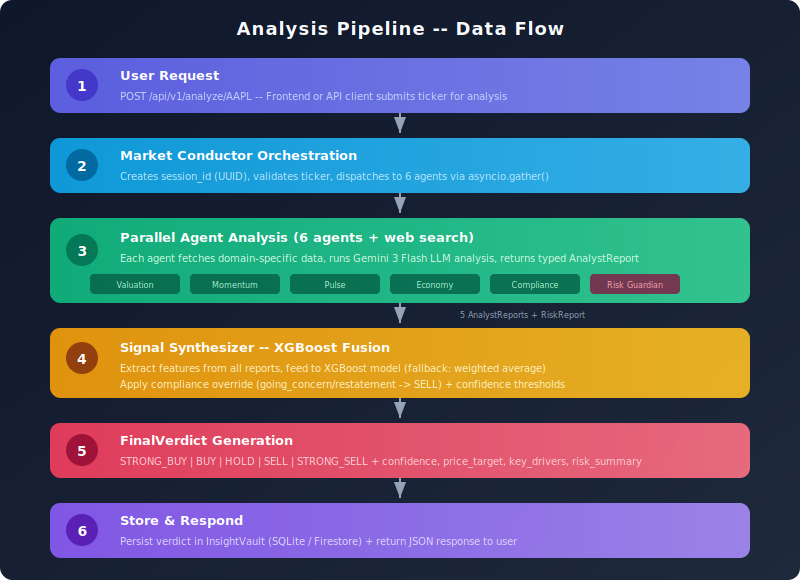
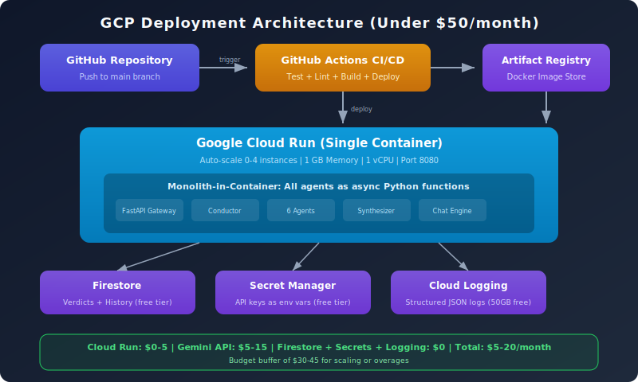

# EquityIQ

Multi-agent stock intelligence system. 7 specialist AI agents analyze stocks in parallel, and an XGBoost synthesizer fuses their signals into a final BUY/HOLD/SELL verdict. Supports US and Indian markets with real-time web search, conversational AI chat, broker integrations, and automated alerts.

## Screenshots

<p align="center">
  
</p>
<p align="center"><em>Homepage -- Search any US or Indian stock by name or ticker</em></p>

<p align="center">
  
</p>
<p align="center"><em>Smart autocomplete -- resolves company names to tickers across global exchanges</em></p>

<p align="center">
  
</p>
<p align="center"><em>Analysis results -- BUY/HOLD/SELL verdict with confidence, risk level, price target, and interactive price chart</em></p>

<p align="center">
  
</p>
<p align="center"><em>Detailed breakdown -- confidence bar, risk assessment, agent signals at a glance, and 3-month price history</em></p>

<p align="center">
  
</p>
<p align="center"><em>Agent signal cards -- each AI agent shows its individual signal, confidence, data source, and key metrics</em></p>

---

## Architecture

<p align="center">
  
</p>

Each agent produces a typed `AnalystReport` (Pydantic v2). The synthesizer fuses all signals using an XGBoost model (with weighted-average fallback) into a 5-level verdict: STRONG_BUY / BUY / HOLD / SELL / STRONG_SELL.

### Data Flow

<p align="center">
  
</p>

### GCP Deployment

<p align="center">
  
</p>

For detailed architecture docs, see [docs/architecture.md](docs/architecture.md).

## Key Features

- **Multi-Agent Analysis** -- 7 specialist agents (Valuation, Momentum, Pulse, Economy, Compliance, Risk, Synthesizer) run in parallel
- **XGBoost Signal Fusion** -- ML model fuses agent signals into a 5-level verdict with confidence scores
- **Conversational AI Chat** -- Natural language interface with smart intent detection, inline charts, and company name resolution
- **Web Search Intelligence** -- Serper + Tavily integration for real-time market context
- **Broker Integrations** -- Zerodha (India) and Alpaca (US) for portfolio import and analysis
- **Webhook Alerts** -- Watchlist monitoring with signal change notifications
- **Multi-Market Support** -- US (Polygon/SEC/FRED) + India (Yahoo/SEBI/RBI/NSE)
- **Dark Glassmorphism UI** -- Next.js dashboard with Plus Jakarta Sans + JetBrains Mono typography

## Tech Stack

| Layer | Technology |
|-------|------------|
| Agent Framework | Google ADK + A2A v0.3.0 |
| LLM | Gemini 3 Flash |
| Backend | Python 3.12 / FastAPI / uvicorn |
| ML Synthesis | XGBoost + scikit-learn |
| Validation | Pydantic v2 + pydantic-settings |
| Async HTTP | httpx + aiohttp |
| Caching | cachetools (TTLCache) |
| Memory | SQLite (local) / Firestore (prod) / Vertex AI Memory Bank |
| Frontend | Next.js + TypeScript + Tailwind |
| Deployment | GCP Cloud Run (single container, 0-4 instances) |
| CI/CD | GitHub Actions |
| Secrets | GCP Secret Manager |
| Testing | pytest + pytest-asyncio |
| Linting | ruff (line-length: 100) |

## Data Sources

- **Polygon.io** -- fundamentals, price history, company news
- **FRED** -- macro indicators (GDP, inflation, fed funds rate)
- **NewsAPI** -- news sentiment and event detection
- **SEC Edgar** -- filings, regulatory risk scoring
- **Yahoo Finance** -- global price data, Indian market support
- **Serper** -- Google Search for analyst reports, regulatory news
- **Tavily** -- AI-powered search with summarized results

## Quick Start

### Prerequisites

- Python 3.12+
- Node.js 18+ (for frontend)
- API keys: Google AI, Polygon.io, FRED, NewsAPI (see [Environment Variables](#environment-variables))

### Setup

```bash
# Clone the repository
git clone https://github.com/nishantgaurav23/equityiq.git
cd equityiq

# Create virtual environment and install dependencies
make install-dev

# Copy environment template and add your API keys
cp .env.example .env
# Edit .env with your API keys

# Run tests to verify setup
make local-test

# Start the development server
make local-dev
```

The API will be available at `http://localhost:8000`. Interactive docs at `http://localhost:8000/docs`.

### Frontend Setup

```bash
cd frontend
npm install
npm run dev
```

The frontend runs at `http://localhost:3000`.

## Running Tests

```bash
# Run full test suite
make local-test

# Or directly with pytest
source venv/bin/activate
python -m pytest tests/ -v --tb=short

# Run a specific test file
python -m pytest tests/test_pipeline.py -v

# Run linter
make local-lint
```

All external services (Polygon, FRED, NewsAPI, SEC Edgar, Gemini) are mocked in tests. No API keys needed to run the test suite.

## Docker

```bash
# Start dev container with hot-reload
make dev

# Run tests in container
make test

# Build production image
docker build --target prod -t equityiq:prod .
```

See [docs/deployment.md](docs/deployment.md) for full deployment instructions.

## API Endpoints

### Core Analysis

| Method | Endpoint | Description |
|--------|----------|-------------|
| POST | `/api/v1/analyze/{ticker}` | Full multi-agent analysis |
| POST | `/api/v1/portfolio` | Portfolio analysis (up to 10 tickers) |
| GET | `/api/v1/history/{ticker}` | Past verdicts for a ticker |
| GET | `/api/v1/history/{ticker}/trend` | Signal trend over time |
| GET | `/api/v1/history` | Recent verdicts across all tickers |
| GET | `/api/v1/verdict/{session_id}` | Retrieve a specific verdict |
| GET | `/api/v1/search?q=...` | Ticker search |
| GET | `/api/v1/price-history/{ticker}` | OHLCV price data |
| GET | `/api/v1/price-history-multi` | Multi-ticker price data |
| GET | `/api/v1/exchange-rate` | Currency exchange rate |
| GET | `/api/v1/agents` | List available agents |
| GET | `/health` | Health check |

### Chat

| Method | Endpoint | Description |
|--------|----------|-------------|
| POST | `/api/v1/chat/` | Streaming conversational AI chat |
| GET | `/api/v1/chat/history/{session_id}` | Chat history for a session |
| DELETE | `/api/v1/chat/history/{session_id}` | Clear chat history |

### Broker Integrations

| Method | Endpoint | Description |
|--------|----------|-------------|
| GET | `/api/v1/zerodha/login` | Zerodha OAuth login |
| GET | `/api/v1/zerodha/callback` | Zerodha OAuth callback |
| GET | `/api/v1/zerodha/holdings` | Zerodha holdings |
| GET | `/api/v1/zerodha/positions` | Zerodha positions |
| GET | `/api/v1/zerodha/portfolio` | Zerodha portfolio summary |
| POST | `/api/v1/zerodha/analyze` | Analyze Zerodha holdings |
| GET | `/api/v1/alpaca/account` | Alpaca account info |
| GET | `/api/v1/alpaca/positions` | Alpaca positions |
| GET | `/api/v1/alpaca/portfolio` | Alpaca portfolio summary |
| POST | `/api/v1/alpaca/analyze` | Analyze Alpaca holdings |
| POST | `/api/v1/alpaca/paper-order` | Place paper trade order |

### Alerts & Webhooks

| Method | Endpoint | Description |
|--------|----------|-------------|
| POST | `/api/v1/alerts/watchlist` | Add ticker to watchlist |
| GET | `/api/v1/alerts/watchlist` | List watched tickers |
| DELETE | `/api/v1/alerts/watchlist/{entry_id}` | Remove from watchlist |
| GET | `/api/v1/alerts/history` | Alert history |
| GET | `/api/v1/alerts/history/{ticker}` | Alert history for ticker |
| POST | `/api/v1/alerts/check-now` | Trigger immediate check |
| GET | `/api/v1/alerts/status` | Alert system status |

Full API reference: [docs/api-reference.md](docs/api-reference.md)

## Environment Variables

Create a `.env` file from the template:

```bash
cp .env.example .env
```

### Required

| Variable | Description |
|----------|-------------|
| `GOOGLE_API_KEY` | Google AI / Gemini API key |
| `POLYGON_API_KEY` | Polygon.io API key |
| `FRED_API_KEY` | FRED API key |
| `NEWS_API_KEY` | NewsAPI key |

### Optional -- Web Search

| Variable | Description |
|----------|-------------|
| `SERPER_API_KEY` | Serper.dev Google Search API key |
| `TAVILY_API_KEY` | Tavily AI Search API key |

### Optional -- Broker Integrations

| Variable | Default | Description |
|----------|---------|-------------|
| `ZERODHA_API_KEY` | | Zerodha Kite Connect API key |
| `ZERODHA_API_SECRET` | | Zerodha API secret |
| `ZERODHA_REDIRECT_URL` | `http://localhost:8000/api/v1/zerodha/callback` | OAuth callback URL |
| `ALPACA_API_KEY` | | Alpaca Trading API key |
| `ALPACA_API_SECRET` | | Alpaca API secret |
| `ALPACA_BASE_URL` | `https://paper-api.alpaca.markets` | Alpaca base URL |
| `ALPACA_DATA_URL` | `https://data.alpaca.markets` | Alpaca data URL |
| `ALPACA_ALLOW_PAPER_TRADING` | `false` | Enable paper trading |

### Optional -- Alerts

| Variable | Default | Description |
|----------|---------|-------------|
| `ALERT_CHECK_INTERVAL_MINUTES` | `60` | How often to re-analyze watched tickers |
| `ALERT_WEBHOOK_SECRET` | | Secret for webhook signature verification |
| `ALERT_MAX_WATCHLIST_SIZE` | `50` | Max tickers per watchlist |
| `ALERT_HISTORY_RETENTION_DAYS` | `90` | Days to retain alert history |

### Infrastructure

| Variable | Default | Description |
|----------|---------|-------------|
| `ENVIRONMENT` | `local` | `local` (SQLite) or `production` (Firestore) |
| `SQLITE_DB_PATH` | `data/equityiq.db` | SQLite database path |
| `LOG_LEVEL` | `INFO` | DEBUG, INFO, WARNING, ERROR |
| `GCP_PROJECT_ID` | | GCP project ID (production only) |
| `GCP_REGION` | `us-central1` | GCP region |

## Project Structure

```
equityiq/
├── config/              # Settings, data contracts, personas, logging
├── tools/               # API connectors (Polygon, FRED, NewsAPI, SEC, Yahoo, Serper, Tavily)
├── models/              # XGBoost signal fusion, risk calculator, model store
├── agents/              # ADK agent implementations (7 + conductor)
├── memory/              # SQLite/Firestore/Vertex AI persistence
├── api/                 # FastAPI routes, chat, broker routes, webhooks
├── integrations/        # Zerodha, Alpaca, portfolio sync, alerts
├── evaluation/          # Quality assessor, benchmarks, backtester, prediction tracker
├── frontend/            # Next.js + TypeScript dashboard
├── tests/               # Test suite (all externals mocked)
├── scripts/             # Launch, stop, health check scripts
├── deploy/              # Cloud Run config, secrets setup, Firestore setup
├── specs/               # Spec-driven development specs
├── docs/                # API reference, architecture, deployment
├── .github/workflows/   # CI (test + lint) and CD (deploy) pipelines
├── app.py               # FastAPI entry point
├── pyproject.toml       # Dependencies and tool config
├── Makefile             # Developer commands
├── Dockerfile           # Multi-stage build
├── docker-compose.yml   # Local dev container
└── roadmap.md           # Full spec index and phase plan
```

## Development

This project follows **spec-driven, test-driven development**. The full build plan is in `roadmap.md` -- 18 phases, 74 specs covering foundation through integrations.

### Make Commands

| Command | Description |
|---------|-------------|
| `make venv` | Create virtual environment |
| `make install` | Install runtime dependencies |
| `make install-dev` | Install runtime + dev dependencies |
| `make local-dev` | Start dev server with hot-reload |
| `make local-test` | Run test suite |
| `make local-lint` | Run ruff linter and formatter |
| `make dev` | Start Docker dev container |
| `make test` | Run tests in Docker |

## The Agents

| Agent | Port | Responsibility | Data Source |
|-------|------|---------------|------------|
| MarketConductor | 8000 | Orchestrator -- routes, aggregates | All agents |
| ValuationScout | 8001 | Fundamentals, valuation ratios | Polygon.io |
| MomentumTracker | 8002 | Price trends, RSI, MACD, SMAs | Polygon.io + technical engine |
| PulseMonitor | 8003 | News sentiment, event detection | NewsAPI + Polygon + web search |
| EconomyWatcher | 8004 | Macro indicators, Fed policy, GDP | FRED + web search |
| ComplianceChecker | 8005 | SEC filings, regulatory risk | SEC Edgar + web search |
| SignalSynthesizer | 8006 | Fuses all signals via XGBoost | All agent reports |
| RiskGuardian | 8007 | Beta, volatility, position sizing | Polygon.io |

## Safety Rules

- **Compliance override**: `going_concern` or `restatement` flags always force SELL
- **Confidence threshold**: STRONG_BUY/STRONG_SELL requires overall_confidence >= 0.75
- **Position sizing**: Suggested position size never exceeds 10% per stock
- **Low data confidence**: Never assign confidence > 0.70 on fewer than 3 news articles
- **Graceful degradation**: Missing agent reduces confidence by 0.20, never crashes

## License

All rights reserved.
