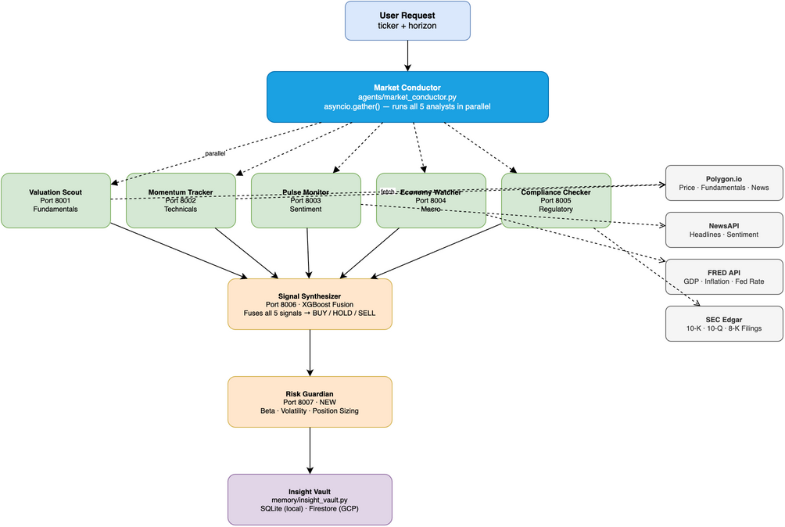

# EquityIQ — Multi-Agent Stock Intelligence System

A production-grade stock analysis system built on **Google ADK**, **A2A Protocol v0.3.0**,
and **Gemini 3 Flash**. Seven specialized AI agents analyze stocks across independent
dimensions simultaneously, then synthesize signals into an actionable recommendation.

---

## Architecture

See the full interactive diagram: [`docs/architecture.drawio`](docs/architecture.drawio)



> Open `docs/architecture.drawio` in [draw.io](https://app.diagrams.net) to edit the diagram.
> Export as PNG and save to `docs/architecture.png` to keep the README image in sync.

---

## What Makes This Different From a Single-Model Approach

| Concern | Single Model | EquityIQ (Multi-Agent) |
|---|---|---|
| Domain depth | Shallow across all areas | Each agent is a specialist |
| Speed | Sequential (slow) | Parallel via `asyncio.gather()` |
| Transparency | Black box | Every agent's signal is visible |
| Failure handling | All-or-nothing | Graceful degradation per agent |
| Scalability | One bottleneck | Each agent scales independently |
| Memory | Stateless | SQLite locally, Firestore on GCP |

---

## The 7 Agents

| Agent File | Port | Responsibility | Data Source |
|---|---|---|---|
| `valuation_scout.py` | 8001 | Financial fundamentals, valuation ratios | Polygon.io |
| `momentum_tracker.py` | 8002 | Price trends, RSI, MACD, moving averages | Polygon.io |
| `pulse_monitor.py` | 8003 | News sentiment, event detection | NewsAPI + Polygon |
| `economy_watcher.py` | 8004 | Macro indicators, Fed policy, GDP | FRED API |
| `compliance_checker.py` | 8005 | SEC filings, regulatory risk | SEC Edgar |
| `signal_synthesizer.py` | 8006 | Fuses all signals → final recommendation | XGBoost model |
| `risk_guardian.py` | 8007 | Portfolio risk, beta, position sizing | Polygon.io |

---

## What EquityIQ Brings to the Table

1. **Real LLM reasoning** — Gemini 3 Flash reads live data and reasons. No deterministic shortcuts.
2. **7th agent: Risk Guardian** — Dedicated risk management (position sizing, beta, correlation).
3. **XGBoost signal synthesis** — Trained ML model replaces a simple weighted average.
4. **Persistent memory** — SQLite locally, Firestore on GCP. Full analysis history queryable.
5. **Multi-stock portfolio analysis** — Analyze a basket of stocks in one call.
6. **Natural language interface** — Ask "How is AAPL doing?" in plain English.
7. **Agent evaluation framework** — `evaluation/` folder to measure and test agent quality.
8. **TTL caching** — Tool fetchers cache API responses to stay within rate limits.
9. **Vertex AI deployment** — Full GCP deployment configs in `deploy/`.

---

## Future Enhancements (Built In)

These are fully built into the project from day one:

- **Long-Term Memory** → `memory/` folder (SQLite → Vertex AI Memory Bank on GCP)
- **Agent Evaluation** → `evaluation/` folder
- **Backtesting** → `evaluation/backtester.py` using historical price data
- **Multi-Stock Analysis** → `market_conductor.py` accepts a list of tickers
- **Advanced ML** → `models/signal_fusion.py` uses XGBoost
- **Risk Management** → `agents/risk_guardian.py` (dedicated 7th agent)
- **Natural Language** → `POST /chat` endpoint in the orchestrator
- **Performance Optimization** → `cachetools.TTLCache` in all tool fetchers
- **Vertex AI Deployment** → `deploy/vertex-deploy.sh`

---

## Project Structure

```
equityiq/
├── agents/
│   ├── valuation_scout.py      # Port 8001 — Fundamentals
│   ├── momentum_tracker.py     # Port 8002 — Technical analysis
│   ├── pulse_monitor.py        # Port 8003 — News sentiment
│   ├── economy_watcher.py      # Port 8004 — Macro economics
│   ├── compliance_checker.py   # Port 8005 — SEC/Regulatory
│   ├── signal_synthesizer.py   # Port 8006 — Final prediction
│   ├── risk_guardian.py        # Port 8007 — Risk management (NEW)
│   └── market_conductor.py     # Orchestrator
│
├── config/
│   ├── analyst_personas.py     # System prompts for each agent
│   └── data_contracts.py       # Pydantic schemas
│
├── tools/
│   ├── polygon_connector.py    # Polygon.io API wrapper + TTL cache
│   ├── fred_connector.py       # FRED API wrapper
│   ├── news_connector.py       # NewsAPI wrapper + sentiment scoring
│   ├── sec_connector.py        # SEC Edgar wrapper + risk scoring
│   └── technical_engine.py    # RSI, MACD, volatility calculations
│
├── models/
│   ├── signal_fusion.py        # XGBoost signal synthesis
│   └── risk_calculator.py      # Portfolio risk math (beta, correlation)
│
├── memory/
│   ├── insight_vault.py        # SQLite session storage
│   └── history_retriever.py    # Query past analyses
│
├── evaluation/
│   ├── quality_assessor.py     # Run agent tests
│   ├── benchmark_cases.py      # Test inputs + expected outputs
│   └── backtester.py           # Historical prediction accuracy
│
├── deploy/
│   ├── Dockerfile.agent        # One Dockerfile for all agents
│   ├── Dockerfile.orchestrator
│   ├── cloudbuild.yaml         # CI/CD pipeline
│   └── vertex-deploy.sh        # Vertex AI deployment script
│
├── scripts/
│   ├── launch_agents.sh        # Start all 7 agents
│   ├── stop_agents.sh          # Stop all 7 agents
│   └── health_check.sh         # Verify all agents are running
│
├── docs/                       # Learning documentation
├── notebooks/                  # Demo Jupyter notebook
├── data/                       # SQLite database (local only)
├── .pids/                      # Agent PID files (runtime)
│
├── app.py                      # FastAPI entry point
├── .env.example                # Environment variable template
├── .gitignore
└── requirements.txt
```

---

## Tech Stack

- **Framework:** Google Agent Development Kit (ADK)
- **Protocol:** A2A v0.3.0 (JSONRPC transport)
- **LLM:** Gemini 3 Flash (`gemini-3-flash-preview`)
- **Backend:** FastAPI + uvicorn
- **ML:** XGBoost + scikit-learn
- **Memory:** SQLite (local) / Firestore (GCP)
- **Frontend:** Next.js + TypeScript + Tailwind CSS
- **Deployment:** Vertex AI Agent Engine + Cloud Run
- **CI/CD:** Google Cloud Build

---

## Quick Start

```bash
# 1. Activate virtual environment
source venv/bin/activate

# 2. Install dependencies
pip install -r requirements.txt

# 3. Set up environment variables
cp .env.example .env
# Edit .env and fill in your API keys

# 4. Start all 7 agents
bash scripts/launch_agents.sh

# 5. Run an analysis
python app.py

# 6. Test a single stock
curl -X POST http://localhost:8000/analyze/AAPL

# 7. Analyze a portfolio
curl -X POST http://localhost:8000/portfolio \
  -H "Content-Type: application/json" \
  -d '{"tickers": ["AAPL", "GOOGL", "MSFT"]}'
```

---

## Build Order

Start from the bottom up — schemas first, tools second, agents third, orchestrator last.

```
1. config/data_contracts.py      ← Schemas (everything depends on this)
2. config/analyst_personas.py    ← System prompts
3. tools/*.py                    ← Data fetchers (test each independently)
4. models/signal_fusion.py       ← Start with weighted avg, upgrade to XGBoost later
5. memory/insight_vault.py       ← Storage layer
6. agents/valuation_scout.py     ← Build one agent, understand the pattern
7. agents/momentum_tracker.py    ← Repeat the pattern
8. agents/pulse_monitor.py
9. agents/economy_watcher.py
10. agents/compliance_checker.py
11. agents/risk_guardian.py      ← New agent (build after the others)
12. agents/signal_synthesizer.py
13. agents/market_conductor.py   ← Orchestrator (depends on everything)
14. app.py                       ← Wire it all together
15. scripts/                     ← Shell scripts
16. evaluation/                  ← Test what you built
```

---

## API Endpoints

| Method | Endpoint | Description |
|---|---|---|
| `POST` | `/analyze/{ticker}` | Single stock analysis |
| `POST` | `/portfolio` | Multi-stock portfolio analysis |
| `POST` | `/chat` | Natural language interface |
| `GET` | `/history/{ticker}` | Past analyses for a ticker |
| `GET` | `/history/{ticker}/trend` | Signal trend over time |
| `GET` | `/health` | Status of all 7 agents |

---

## Learning Resources

See the `docs/` folder for detailed explanations of every concept used in this project.
